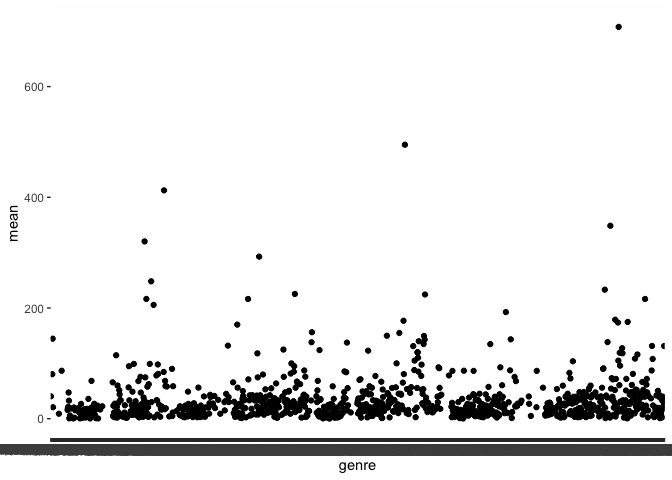

Assignment-B1
================
Jade
2022-10-27

``` r
library(datateachr)
library(tidyverse)
```

    ## ── Attaching packages ─────────────────────────────────────── tidyverse 1.3.2 ──
    ## ✔ ggplot2 3.3.6      ✔ purrr   0.3.4 
    ## ✔ tibble  3.1.8      ✔ dplyr   1.0.10
    ## ✔ tidyr   1.2.1      ✔ stringr 1.4.1 
    ## ✔ readr   2.1.2      ✔ forcats 0.5.2 
    ## ── Conflicts ────────────────────────────────────────── tidyverse_conflicts() ──
    ## ✖ dplyr::filter() masks stats::filter()
    ## ✖ dplyr::lag()    masks stats::lag()

``` r
library(devtools)
```

    ## Loading required package: usethis

``` r
library(testthat)
```

    ## 
    ## Attaching package: 'testthat'
    ## 
    ## The following object is masked from 'package:devtools':
    ## 
    ##     test_file
    ## 
    ## The following object is masked from 'package:dplyr':
    ## 
    ##     matches
    ## 
    ## The following object is masked from 'package:purrr':
    ## 
    ##     is_null
    ## 
    ## The following objects are masked from 'package:readr':
    ## 
    ##     edition_get, local_edition
    ## 
    ## The following object is masked from 'package:tidyr':
    ## 
    ##     matches

\#Exercise 1: Make a Function (25 points)

``` r
quick_group_summarise <- function(data, x, y) {
  data %>%
  group_by({{x}}) %>%
  summarise(mean = mean({{y}}, na.rm = TRUE))
  }
```

\#Exercise 2: Document your Function (20 points)

``` r
#' Quick Group By and Summarize a Mean 
#' 
#' This function first groups by one variable in your data set (x). Then, it summarizes the mean of a chosen numeric variable (y) for each value in the grouped by variable (x) and produces a new tibble. 
#'
#' @param data #The data set you would like to work with. #I named this argument "data" because I think it is simple and descriptive. This is where people will put the dataset that they would like to use. 
#' @param x #Any variable from your data set that you would like to examine. #I named this argument "x" because it follows the general format of x, y arguments that appear in other functions. For instance, if you want to plot the data used in this function, the aes(x, y) component also follows this same format.
#' @param y #Any numeric variable from your data set. #I named this argument "y" for the same reason I named the above argument "x". It follows the general format of x, y arguments that appear in other functions. For instance, if you want to plot the data used in this function, the aes(x, y) component also follows this same format. I want to make it clean and as easy to use and understand as possible.
#'
#' @return #This function will return a tibble that shows the grouped by variable (x) and the corresponding mean of the numeric variable (y). There will only be two columns in this new tibble. 

quick_group_summarise <- function(data, x, y) {
  data %>%
  group_by({{x}}) %>%
  summarise(mean = mean({{y}}, na.rm = TRUE))
  }
```

\#Exercise 3: Include Examples (15 points)

``` r
quick_group_summarise(steam_games, genre, original_price)
```

    ## # A tibble: 1,769 × 2
    ##    genre                                                                    mean
    ##    <chr>                                                                   <dbl>
    ##  1 Accounting                                                              47.5 
    ##  2 Accounting,Animation & Modeling,Audio Production,Design & Illustration… 20.0 
    ##  3 Accounting,Animation & Modeling,Audio Production,Design & Illustration…  5.00
    ##  4 Accounting,Education,Software Training,Utilities,Early Access            0   
    ##  5 Action                                                                  11.0 
    ##  6 Action,Adventure                                                        13.8 
    ##  7 Action,Adventure,Casual                                                 41.5 
    ##  8 Action,Adventure,Casual,Early Access                                    15.0 
    ##  9 Action,Adventure,Casual,Free to Play                                     4.99
    ## 10 Action,Adventure,Casual,Free to Play,Early Access                        0   
    ## # … with 1,759 more rows

``` r
#In this example I am testing whether the function works

quick_group_summarise(steam_games, languages, original_price)
```

    ## # A tibble: 5,497 × 2
    ##    languages                                                                mean
    ##    <chr>                                                                   <dbl>
    ##  1 Czech, Dutch, English, French, German, Italian, Polish, Russian, Spani…  20.0
    ##  2 Czech, Dutch, English, French, Italian, Polish, Russian, Spanish - Spa…  15.0
    ##  3 Czech, English, French, German, Italian, Polish, Russian, Spanish - Sp…  26.5
    ##  4 Czech, English, French, German, Italian, Polish, Russian, Spanish - Sp…  30.0
    ##  5 Czech, English, French, German, Italian, Polish, Spanish - Spain         25.0
    ##  6 Danish, Dutch, English, French, German, Italian, Norwegian, Polish, Po…  30.0
    ##  7 Dutch, English, French, German, Italian, Spanish - Spain, Czech, Finni… NaN  
    ##  8 English                                                                  98.2
    ##  9 English, Czech                                                          NaN  
    ## 10 English, Czech, Danish, Dutch, Finnish, French, German, Hungarian, Ita…  30.0
    ## # … with 5,487 more rows

``` r
#In this example I am testing whether the function still works with a different x variable chosen 

quick_group_summarise(vancouver_trees, genus_name, diameter)
```

    ## # A tibble: 97 × 2
    ##    genus_name   mean
    ##    <chr>       <dbl>
    ##  1 ABIES       12.9 
    ##  2 ACER        10.6 
    ##  3 AESCULUS    23.7 
    ##  4 AILANTHUS   15.9 
    ##  5 ALBIZIA      6   
    ##  6 ALNUS       17.5 
    ##  7 AMELANCHIER  3.21
    ##  8 ARALIA       6.81
    ##  9 ARAUCARIA   11.4 
    ## 10 ARBUTUS     18.4 
    ## # … with 87 more rows

``` r
#In this example I am testing whether the function still works with an entirely different dataset 

quick_group_summarise(vancouver_trees, genus_name, diameter) %>%
    ggplot(aes(genus_name, mean)) +
    geom_point()
```

<!-- -->

``` r
#In this example I am testing whether I can use my new function to speed up the process of creating a plot 

quick_group_summarise(steam_games, genre, discount_price) %>%
    ggplot(aes(genre, mean)) +
    geom_point()
```

    ## Warning: Removed 707 rows containing missing values (geom_point).

<!-- -->

``` r
#In this example I am testing the use of the function in creating a plot with a different dataset  
```

\#Exercise 4: Test the Function (25 points)

``` r
test_that("Warning occurs when Y is not numeric", 
{expect_warning(quick_group_summarise(steam_games, genre, languages))}) 
```

    ## Test passed 🌈

``` r
test_that("Error occurs when data is not included", 
{expect_error(quick_group_summarise(genre, original_price))}) 
```

    ## Test passed 🌈

``` r
test_that("Name of the y variable changes to mean", 
{expect_named(quick_group_summarise(steam_games, genre, original_price), c("genre", "mean"))}) 
```

    ## Test passed 🥳

``` r
test_that("All Previous Tests Pass Together", 
          {expect_warning(quick_group_summarise(steam_games, genre, languages))
            expect_error(quick_group_summarise(genre, original_price))
            expect_named(quick_group_summarise(steam_games, genre, original_price), c("genre", "mean"))})
```

    ## Test passed 😸
